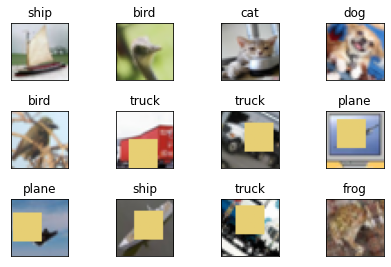
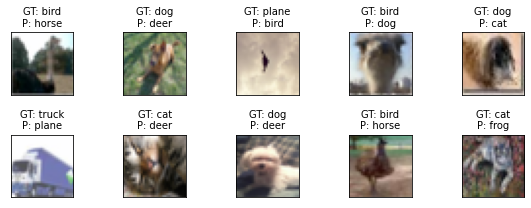
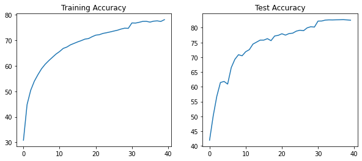
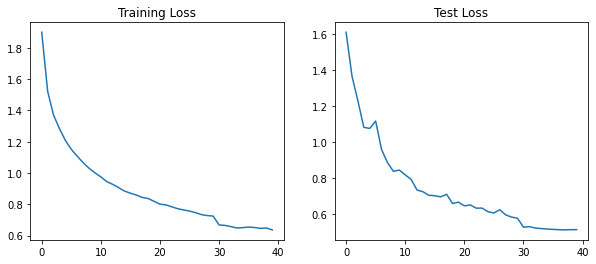

# Advanced concepts

The task here is to make use of some advanced convolutions and augmentation strategies to train a model for CIFAR-10 dataset.

We have to make use of:

1. Depthwise Separable Convolution
2. Dilated Convolution
3. Total RF must be more than 44
4. GAP (as usual)
5. Using **albumentations** library to apply the following augmentations:
   1. Horizontal flip
   2. ShiftScaleRotate
   3. CoarseDropout 

Target is to achieve 85% accuracy with the model parameter count being less than 200k.

## Dataset

Following are some samples from the dataset after applying augmentations:

## About

- The model has **129,082** parameters. 
- The training was done of **40** epochs, first 30 with an lr of 0.01 and next 10 with an lr of 0.001.
- Highest training accuracy achieved was 78.07 (40th Epoch)
- Highest test accuracy achieved was 82.73 (38th Epoch)

## Training Results

Misclassified images:

Accuracy curves:

Loss curves:

