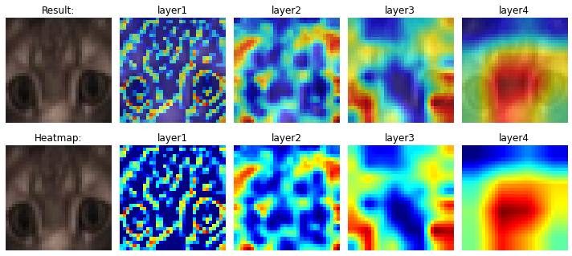
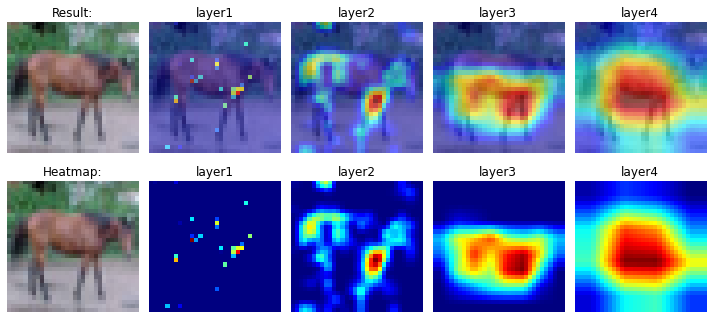

# Advanced training concepts

This time, we will be training a ResNet18 model over CIFAR-10 dataset and also use GradCam to understand what the model is trying to see in order to predict a particular class.

But what is **GradCam** in simple terms?

ChatGPT explains it as :

GradCam is a technique for visualizing the regions in an image that contribute the most to a particular prediction made by a Convolutional Neural Network (CNN). It's used to better understand how CNNs make predictions, especially in cases where they make incorrect predictions.

GradCam works by backpropagating the gradients of the prediction with respect to the activations of a chosen layer, and then weighting the activations of each channel by these gradients. The resulting values are then up-sampled to the original image size and overlaid on the image, highlighting the regions that have the most influence on the prediction.

In simpler terms, GradCam uses the gradients of the prediction to highlight the areas of the image that are most relevant to the prediction made by the CNN, making it easier to see why the network is making the predictions it is.

## Training and results

Our dataset looks like below after applying CutOut and RandomCrop augmentations:

We trained for 20 Epochs and achieved a maximum validation accuracy of 83.45% and maximum training accuracy of 75.31%.

The accuracy and  loss curves are as follows:

Some misclassified images:

### GradCam results

