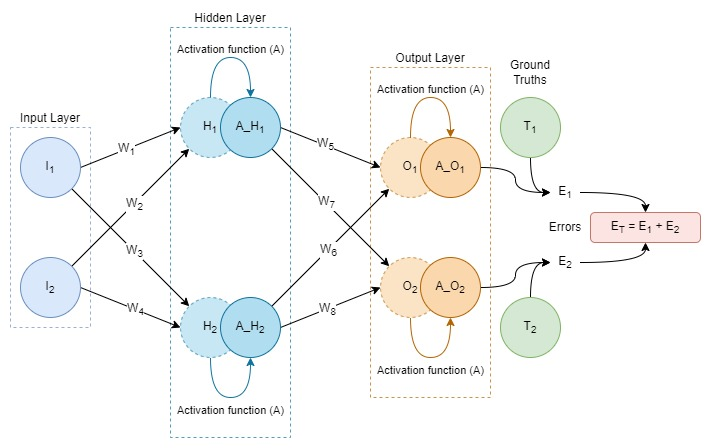
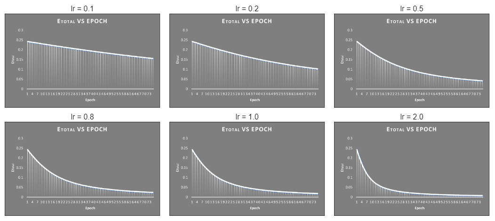

# Backpropagation

This section is dedicated towards understanding how exactly does the *Backpropagation* algorithm work. This algorithm is essentially used to propagate the errors backward in the model, which in turn is used as a feedback in updating and fine-tuning the weights and decrease the loss value (calculated using the predicted output and the ground truth). Let's consider a simple network for our use case:

  

For our computations, we are considering *Sigmoid* activation function and L2 loss function.
$$
A = σ = \frac{1}{(1 + e^{-x})}
$$ {Sigmoid Activation function}

$$
E = \frac{1}{2}(T - A\_O)^2
$$ {L2 Loss}

Now, we have these basic equations:

| Step | Equations                     | Details                                                      |
| ---- | ----------------------------- | ------------------------------------------------------------ |
| 1    |  | These are the basic equations that will help us in our further computations. The activated output from each neuron is calculated by applying activation functions on the output calculated with the help of *input values* and the *weights* in each layer. Error is calculated according to the Loss function used with the help of *target values* (Ground truth) and the Model *output*. |
| 2    |  | We have to calculate gradients/partial derivatives of all the weights in the model w.r.t the total error. The first set of weights that we encounter while backpropagation are W5, W6, W7, W8 and hence we calculate the partial derivatives for these first. Considering W5 for our calculations, the same can be extrapolated to obtain values for other partial derivatives.   Since E2 does not have a dependency on W5, it is treated as a constant. Expanding the partial derivative of E1 w.r.t W5, we calculate individual components which can be substituted back. |
| 3    |  | Combining the obtained equations, we get the partial derivative of ET w.r.t W5. Following the similar computations we also get the partial derivatives of ET w.r.t W6, W7 and W8. |
| 4    |  | The next set of weights that we encounter while backpropagation are W1, W2, W3, W4 and hence the partial derivatives for these have to be calculated next. We will calculate this w.r.t W1 and the same can be extrapolated to others. For this, we need to calculate the firs component, i.e., partial derivative of ET w.r.t A_H1. Other two components can be calculated using simple partial differentiation. |
| 5    |  | For calculating the partial derivative of  ET w.r.t A_H1, we need to calculate partial derivative of  E1 and E2  w.r.t A_H1 . We are calculating for E1 first and it can be calculated for E2 in the similar way. Partial derivative of  E1 w.r.t A_H1 can be expanded and calculated by calculating the individual components as shown. |
| 6    |  | From the above calculation and using the similar format to calculate for others, we have the equations for partial derivate of E1 and E2  w.r.t A_H1 and A_H2. |
| 7    |  | Now, using the calculated equations and substituting them back we have the equations for partial derivative of  ET w.r.t A_H1 and A_H2 . |
| 8    |  | Using the equations mentioned in Step 4 and other computed equations, we get our final equations for the partial derivatives of ET w.r.t W1, W2, W3 and W4. |

Now, all these partial derivatives of the total error w.r.t each of the weights is used in calculating the step values (updated values) of the weights after each backpropagation. For updating the weights, we also use a multiplications factor which is called the **learning rate** (η). The step values are calculated as follows:
$$
W_{x}(Updated) = W_{x}(Old) - η\frac{∂E_T}{∂W_x}
$$
The numeric computations can be referred from the Excel Sheet. Using certain initial values and altering the learning rate, the following graphs were obtained:

| T1   | T2   | I1   | I2   | W1   | W2   | W3   | W4   | W5   | W6   | W7   | W8   |
| ---- | ---- | ---- | ---- | ---- | ---- | ---- | ---- | ---- | ---- | ---- | ---- |
| 0.01 | 0.99 | 0.05 | 0.1  | 0.15 | 0.2  | 0.25 | 0.3  | 0.4  | 0.45 | 0.5  | 0.55 |

  

# Architectural basics
