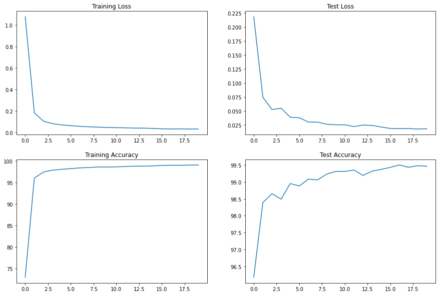

# Backpropagation

This section is dedicated towards understanding how exactly does the *Backpropagation* algorithm work. This algorithm is essentially used to propagate the errors backward in the model, which in turn is used as a feedback in updating and fine-tuning the weights and decrease the loss value (calculated using the predicted output and the ground truth). Let's consider a simple network for our use case:

  

For our computations, we are considering *Sigmoid* activation function and *L2 loss* function.

$$A = σ = \frac{1}{(1 + e^{-x})}$$

$$E = \frac{1}{2}(T - A\_O)^2$$

Now, we have these basic equations:

| Step | Equations                     | Details                                                      |
| ---- | ----------------------------- | ------------------------------------------------------------ |
| 1    | 

 | These are the basic equations that will help us in our further computations. The activated output from each neuron is calculated by applying activation functions on the output calculated with the help of *input values* and the *weights* in each layer. Error is calculated according to the Loss function used with the help of *target values* (Ground truth) and the Model *output*. |
| 2    | 

 | We have to calculate gradients/partial derivatives of all the weights in the model w.r.t the total error. The first set of weights that we encounter while backpropagation are W5, W6, W7, W8 and hence we calculate the partial derivatives for these first. Considering W5 for our calculations, the same can be extrapolated to obtain values for other partial derivatives.   Since E2 does not have a dependency on W5, it is treated as a constant. Expanding the partial derivative of E1 w.r.t W5, we calculate individual components which can be substituted back. |
| 3    | 

 | Combining the obtained equations, we get the partial derivative of ET w.r.t W5. Following the similar computations we also get the partial derivatives of ET w.r.t W6, W7 and W8. |
| 4    | 

 | The next set of weights that we encounter while backpropagation are W1, W2, W3, W4 and hence the partial derivatives for these have to be calculated next. We will calculate this w.r.t W1 and the same can be extrapolated to others. For this, we need to calculate the firs component, i.e., partial derivative of ET w.r.t A_H1. Other two components can be calculated using simple partial differentiation. |
| 5    | 

 | For calculating the partial derivative of  ET w.r.t A_H1, we need to calculate partial derivative of  E1 and E2  w.r.t A_H1 . We are calculating for E1 first and it can be calculated for E2 in the similar way. Partial derivative of  E1 w.r.t A_H1 can be expanded and calculated by calculating the individual components as shown. |
| 6    | 

 | From the above calculation and using the similar format to calculate for others, we have the equations for partial derivate of E1 and E2  w.r.t A_H1 and A_H2. |
| 7    | 

 | Now, using the calculated equations and substituting them back we have the equations for partial derivative of  ET w.r.t A_H1 and A_H2 . |
| 8    | 

 | Using the equations mentioned in Step 4 and other computed equations, we get our final equations for the partial derivatives of ET w.r.t W1, W2, W3 and W4. |

Now, all these partial derivatives of the total error w.r.t each of the weights is used in calculating the step values (updated values) of the weights after each backpropagation. For updating the weights, we also use a multiplications factor which is called the **learning rate** (η). The step values are calculated as follows:
$$W_{x}(Updated) = W_{x}(Old) - η\frac{∂E_T}{∂W_x}$$
The numeric computations can be referred from the Excel Sheet. The following initial values  were used:

| T1 | T2 | I1 | I2 | W1 | W2 | W3 | W4 | W5 | W6 | W7 | W8 |
| ------------- | ------------- | ------------- | ------------- | ------------- | ------------- | ------------- | ------------- | ------------- | ------------- | ------------- | ------------- |
| 0.01          | 0.99          | 0.05          | 0.1           | 0.15          | 0.2           | 0.25          | 0.3           | 0.4           | 0.45          | 0.5           | 0.55          |

By altering the learning rate, the following graphs were obtained:

  

# Architectural basics

We have some basic components and concepts that are necessary to understand in order to build a good model and provide it with a good training. These are:

1. Number of layers
2. MaxPooling
3. 1x1 Convolutions
4. 3x3 Convolutions
5. Receptive Field
6. SoftMax
7. Learning Rate
8. Kernels and how do we decide the number of kernels?
9. Batch Normalization
10. Image Normalization
11. Position of MaxPooling
12. Concept of Transition Layers
13. Position of Transition Layers
14. Dropout
15. When do we introduce Dropout, or when do we know we have some overfitting
16. The distance of MaxPooling from the Prediction layer
17. The distance of Batch Normalization from Prediction layer
18. How do we know our network is not going well, comparatively, very early
19. Batch Size, and effects of batch size, etc.

The idea here is to apply all these concepts and build a model to train over MNIST dataset and achieve *more than 99.4%* Validation accuracy with less than *20K Parameters* and *within 20 epochs*.

While performing these exercise, a few **observations** were made (we are referring to validation accuracy everywhere below):

1. The convergence of the accuracy was very fast till 98-99%
2. Even the a lighter model (with less than 3-4K parameters) could easily be trained to achieve 98-99% accuracy.
3. Given X number of parameters and a good crafting of model, a model which is deeper with approximately X no. of parameters performed much better than if we would just get the parameter count high by increasing the no. of channels.
4. There were few images in the validation dataset that the model was actually struggling to predict correctly:

  

After observing the incorrectly predicted images, certain augmentations like **Center crop** and **Random rotation** were used to mimic the rough data while training. The model architecture and the training can be referred from the `ArchitecturalBasics.ipynb` notebook.

1. Model Parameter Count: 12,696
2. Total training epochs: 20
3. Highest Validation Accuracy: 99.5%

Loss and accuracy curve:

  

