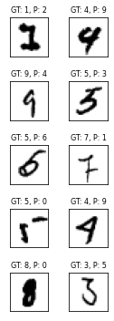

# Batch Normalization & Regularization

Here, we will be training a model using three different normalization techniques, Group Normalization, Layer Normalization and Batch Normalization. The losses and accuracies have to be compared for all three trainings.

Note: While training the model with Batch Norm. we will also be adding the L1 regularization term to the loss.

## Group vs Layer vs Batch Normalizations

  

## Loss

  

## Accuracies

  

## Misclassifications

| Group Norm.                            | Layer Norm.                            | Batch Norm.                            |
| -------------------------------------- | -------------------------------------- | -------------------------------------- |
|  |  |  |

