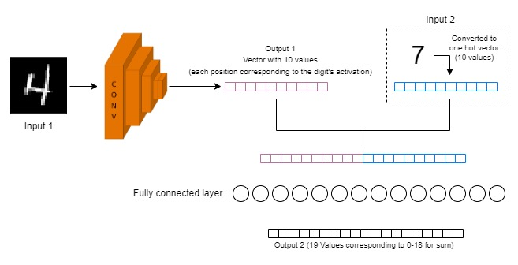
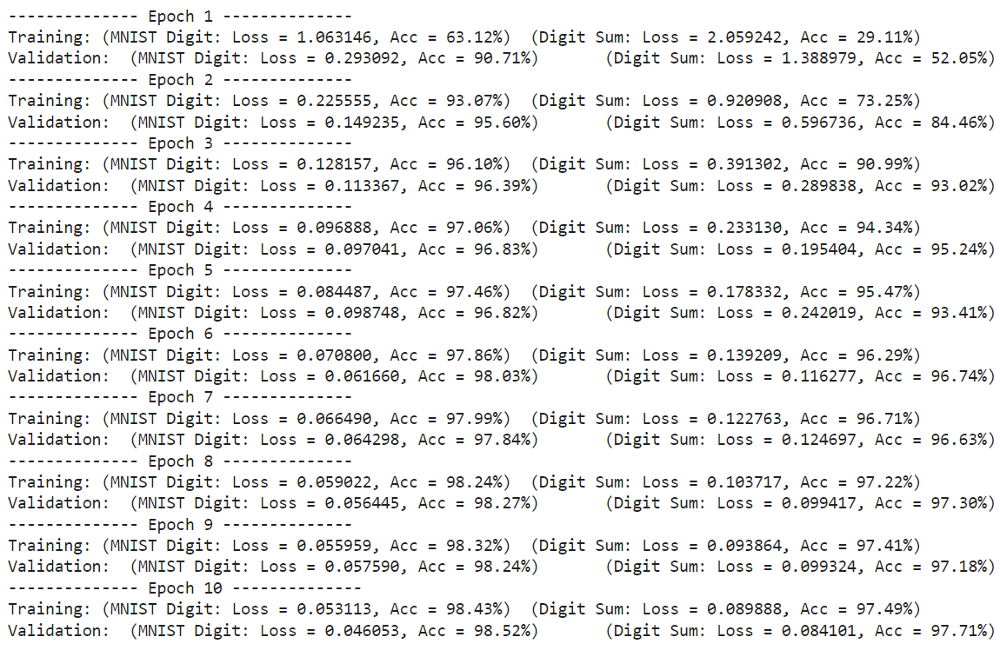

# PyTorch101

This is a brush-up of PyTorch through training a model over MNIST dataset with a slight twist.

The idea here is to train a model which:

- Takes 2 inputs:
  1. An image from MNIST dataset
  2. A random number between 0 and 9
- Produces 2 outputs:
  1. A general prediction of the digit in the image from MNIST dataset
  2. Sum of the 2nd input image and the digit from MNIST image


## Data

A custom dataset class has been written which in-turn uses MNIST dataset from Torchvision and also provides us the additional random input number and the ground truth for *Sum*. For random number, we generate a list of numbers of the same size as of Dataset with digits between *0* and *9* using ```torch.randint``` function which now has a corresponding number for every image in the dataset (Alternatively, we could just generate a random digit instead of storing the entire list but the list makes sure that the data is uniformly distributed). The dataset class returns a dictionary of 4 elements as follows:

> 'input_mnist_image' : MNIST dataset images of size (1, 28, 28)
>
> 'input_number' : The additional input which has to be added (A number between 0 to 9)
>
> 'mnist_gt' : Ground truth for the MNIST image
>
> 'sum_gt' : Ground truth for the sum (A number between 0 to 18)

A sample from the data:


## Model

Let's have a look at our model:



The input image (MNIST) is passed though a CNN and the output vector from the CNN (predicted MNIST digit) is concatenated with the other input number (Converted to one hot vector) and the resulting vector of *20* blocks is connected to a Fully connected layer. The fully connected layer is connected to the output vector of 19 values (corresponding to numbers from 0-18) which is the predicted sum.


## Training

The model can be trained on **CPU** or **GPU** (our training is done on GPU). The training logs are as follows:



The accuracy is measured through calculating the total number of correct predictions in a batch. We can very well see that the training loss and the validation loss are almost close which implies that our model isn't overfitting the data much.

```
By the end of the 10th Epoch:
	Training accuracy for MNIST digit	: 98.43%
	Training accuracy for the sum	 	: 97.49%
	
	Validation accuracy for MNIST digit	: 98.52%
	Validation accuracy for the sum	 	: 97.71%
```

The loss function used is Cross Entropy which had a very fast loss convergence. This is a very simple loss function which evaluates the class predictions for each class in the vector individually and then takes the average.


