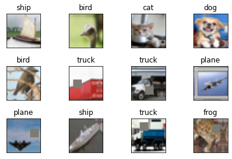
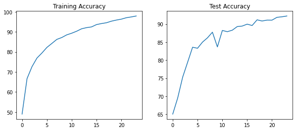
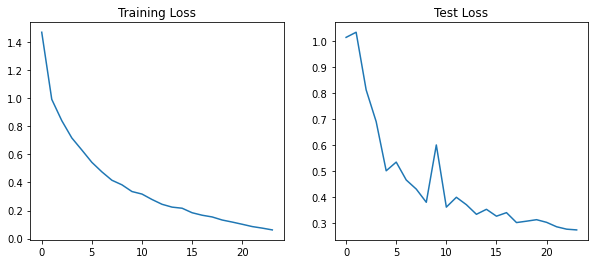
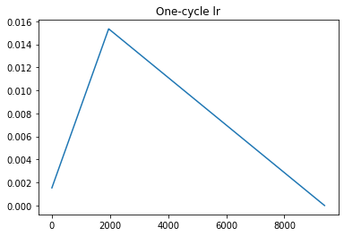
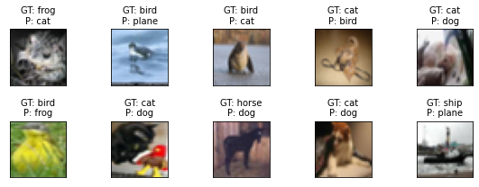

# ResNets and Higher receptive fields

Write a custom ResNet architecture for CIFAR10 that has the following architecture:

1. 1. PrepLayer - Conv 3x3 s1, p1) >> BN >> RELU [64k]
   2. Layer1 -
      1. X = Conv 3x3 (s1, p1) >> MaxPool2D >> BN >> RELU [128k]
      2. R1 = ResBlock( (Conv-BN-ReLU-Conv-BN-ReLU))(X) [128k] 
      3. Add(X, R1)
   3. Layer 2 -
      1. Conv 3x3 [256k]
      2. MaxPooling2D
      3. BN
      4. ReLU
   4. Layer 3 -
      1. X = Conv 3x3 (s1, p1) >> MaxPool2D >> BN >> RELU [512k]
      2. R2 = ResBlock( (Conv-BN-ReLU-Conv-BN-ReLU))(X) [512k]
      3. Add(X, R2)
   5. MaxPooling with Kernel Size 4
   6. FC Layer 
   7. SoftMax
2. Uses One Cycle Policy such that:
   1. Total Epochs = 24
   2. Max at Epoch = 5
   3. LRMIN = FIND
   4. LRMAX = FIND
   5. NO Annihilation
3. Uses this transform - RandomCrop 32, 32 (after padding of 4) >> FlipLR >> Followed by CutOut (8, 8)
4. Batch size = 512
5. Target Accuracy: 90%

We will find LRMAX using LRFinder and LRMIN will be 1/10th of LRMAX.

## Training and results

Our dataset looks like below after applying the above augmentations:

We trained for 24 Epochs and achieved a maximum validation accuracy of 92.24% and maximum training accuracy of 97.92. The model was overfitting in the later part of the training. Also, batch size used was 128 instead of 512.

The accuracy and loss curves are as follows:

The LR was adjusted using One cycle policy. The LR curve looks like this.

Some misclassified images:

